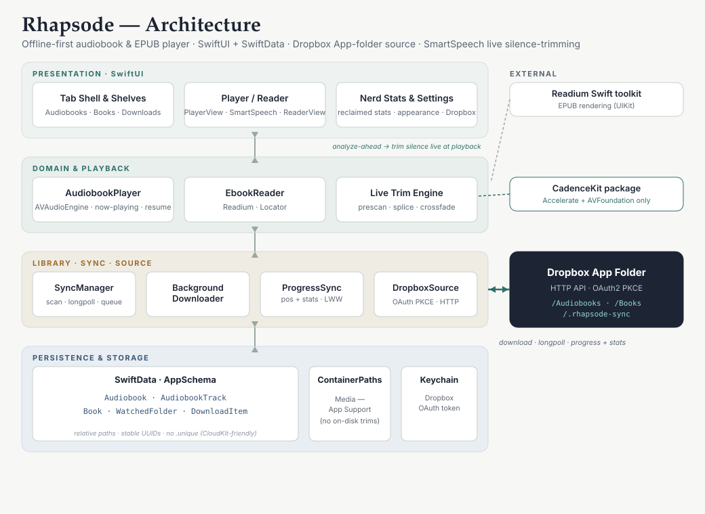

# Rhapsode

**An offline-first audiobook & EPUB player that keeps your library in a Dropbox app folder — and trims the dead air out of narration so books play faster without sounding edited.**

Native SwiftUI for iPhone, iPad, and Mac (Catalyst). Every file is downloaded in full and played from local storage; nothing streams. Dropbox is reached over its plain HTTP API (no SDK), so the design ports cleanly to a planned Android client.

<p align="center">
  
</p>

> A fuller, interactive design write-up lives in [`docs/design.html`](docs/design.html). The canonical specs are [`docs/SPEC.md`](docs/SPEC.md) and [`docs/ROADMAP.md`](docs/ROADMAP.md).

---

## Features

### Audiobooks
- Single-file **M4B** (chapter metadata) and **MP3 folders** (ID3 track order) behind one `(trackIndex, offset)` model
- Play/pause, scrub, skip ±15/30 s, variable speed, resume from last position
- Background audio + lock-screen / Control Center controls
- Chapter/track list with tap-to-jump

### E-books
- **Readium** reflowable EPUB reader — font size, light / dark / sepia, table of contents
- Resume to the last reading `Locator`

### Source & sync (Dropbox app folder)
- Connect Dropbox via **OAuth 2 PKCE** (token in Keychain); the API is reached over raw HTTP, not the Swift SDK
- Two fixed watched roots inside the app folder: `/Audiobooks` and `/Books`
- **Foreground auto-detect** via `longpoll`, **background `URLSession`** downloads with a visible queue, local start/finish notifications, and a manual “Scan now” fallback
- **Cross-device progress sync** — positions written as small JSON files under `/.rhapsode-sync` (last-writer-wins), keyed by the stable cross-device container path

### SmartSpeech — live silence-trimming
- Shortens silences in narration so books play faster *without sounding edited* (adaptive noise floor, residual-gap floor, edge guards, equal-power crossfades — not hard silence-skipping)
- Global on/off + **Default / More / Aggressive** profiles; per-book override (a book can pick its own profile, turn it off, or force it on even when global is off) — set from the in-player **SmartSpeech** sheet alongside speed
- Honest **“reclaimed time”** stat, lifetime and per-book — its own **Nerd Stats** tab
- Trimmed **live during playback** — no pre-render, no trimmed copy on disk

---

## How SmartSpeech works

SmartSpeech trims silence **live during playback**. `AudiobookPlayer` drives an AVAudioEngine graph (`AVAudioPlayerNode → AVAudioUnitTimePitch → mixer`) fed by `LiveTrimProducer`, which decodes the **original** file, splices silence out of the **original channels** on the fly, and self-schedules buffers — building a live source↔output map as it goes. A background prescan (`LiveSilencePrescan`) sets a whole-file adaptive floor so detection stays stable.

Non-negotiable correctness rules:
- The original download is the **source of truth** and is never modified; there is **no on-disk trimmed copy** — trimming happens in memory during playback.
- All persisted positions/bookmarks/chapters live in **source time**; they are mapped to output time only at the playback boundary via the live map, so they stay stable across tier changes and on/off toggles.
- Silence is **detected** on the mono downmix but **cut** from the original channels, zero-crossing-aligned with equal-power crossfades (a hard cut is a bug). An adaptive floor + absolute ceiling keep continuous music beds from being cut.

`CadenceKit` is a standalone Swift package (the silence-analysis DSP) that imports only **Accelerate** + **AVFoundation** — no app or SwiftUI types — so it stays liftable. See [`specs/cadence-feature-spec.md`](specs/cadence-feature-spec.md) and [`specs/realtime-cadence-exploration.md`](specs/realtime-cadence-exploration.md).

---

## Architecture

Four layers, backend-agnostic above the source boundary:

| Layer | What it does |
|---|---|
| **Presentation** (SwiftUI) | Tab shell, library shelves, player + SmartSpeech sheet, reader, Nerd Stats & settings, downloads |
| **Domain & playback** | `AudiobookPlayer` driving the live-trim engine (`LiveAudioBackend`/`LiveTrimProducer`, AVAudioEngine + CadenceKit DSP), `EbookReader` (Readium) |
| **Library / sync / source** | `SyncManager`, `BackgroundDownloader`, `ProgressSync`, and `DropboxSource` behind the `LibrarySource` protocol |
| **Persistence & storage** | SwiftData (`AppSchema`), `ContainerPaths` (media in Application Support — no on-disk trims), Keychain |

All remote access goes through one `LibrarySource` protocol, so Dropbox is swappable and the download/watch pipeline never knows the backend.

### Project structure

| Directory | Responsibility | Key types |
|---|---|---|
| `Sources/App/` | Tab shell, shelves, settings, lifecycle | `RhapsodeApp`, `RootTabView`, `SettingsView` |
| `Sources/Audiobook/` | Import & playback (both formats) + SmartSpeech UI | `AudiobookPlayer`, `PlayerView`, `SmartSpeechSheet` |
| `Sources/CadenceLive/` | Live on-the-fly trim engine (AVAudioEngine) | `LiveAudioBackend`, `LiveTrimProducer`, `LiveSilencePrescan` |
| `Sources/Ebook/` | EPUB reading via Readium | `EbookReader`, `ReaderView` |
| `Sources/Cadence/` | Trim gating, timeline map, stats, Nerd Stats UI | `Audiobook+Cadence`, `CadenceTimelineMap`, `CadenceStats`, `NerdStatsView` |
| `Sources/Source/` | Remote library behind one protocol | `LibrarySource`, `DropboxSource`, `KeychainTokenStore` |
| `Sources/Sync/` | Scan, watch, download queue, progress sync | `SyncManager`, `BackgroundDownloader`, `ProgressSync` |
| `Sources/Model/` | SwiftData schema + repository | `Models` (`AppSchema`), `LibraryStore` |
| `Sources/Support/` | Container paths, design system, self-test | `ContainerPaths`, `DesignSystem` |
| `CadenceKit/` | Standalone silence-analysis DSP package | `SilenceAnalyzer`, `SilencePolicy`, `AudioIO` |

---

## Tech stack

- **SwiftUI** + Swift Concurrency, Swift 6 strict concurrency
- **SwiftData** persistence — stable `UUID`s, relative paths only, no `@Attribute(.unique)` (CloudKit-friendly)
- **AVAudioEngine** live-trim graph + `MPNowPlayingInfoCenter` / `MPRemoteCommandCenter`
- **Readium Swift toolkit** for EPUB
- **CadenceKit** — Accelerate (vDSP) + AVFoundation
- Background `URLSession`, `BGTaskScheduler`, `UNUserNotificationCenter` (no paid entitlements in the MVP)
- **XcodeGen** project generation + a headless self-test harness

---

## Build & run

This is an [XcodeGen](https://github.com/yonaskolb/XcodeGen) project — the `.xcodeproj` is generated and git-ignored. **Never hand-edit it**; edit `project.yml` and regenerate.

```bash
# 1. Generate the Xcode project
xcodegen generate

# 2. Build & run for a simulator (or open Rhapsode.xcodeproj in Xcode)
xcodebuild -project Rhapsode.xcodeproj -scheme Rhapsode \
  -configuration Debug \
  -destination 'platform=iOS Simulator,name=iPhone 17 Pro' build
```

No Dropbox account is needed to try it: in a Debug build, the Audiobooks shelf has a **🐞 Load samples** button (or launch with `-loadsamples`) that imports bundled M4B + MP3-folder fixtures via a mock source.

### Headless self-test

Two `#if DEBUG` harnesses verify the non-UI invariants end to end:

```bash
# Container paths + sync pipeline + progress mapping
xcrun simctl launch --console-pty <booted-device> com.naufalmir.rhapsode -phase0selftest 1

# Live silence-trimming engine (position/resume/seek, music-bed sparing, multi-file)
xcrun simctl launch --console-pty <booted-device> com.naufalmir.rhapsode -livecadenceselftest
# → each prints PASS/FAIL per check
```

CadenceKit also has its own unit tests: `cd CadenceKit && swift test`.

---

## Platform & status

| | Status |
|---|---|
| MVP — sync, downloads, audiobook player, EPUB reader | ✅ Built |
| iPad adaptive layout · Mac Catalyst | ✅ Built |
| Cross-device progress sync (Dropbox app folder) | ✅ Built |
| SmartSpeech live silence-trimming (global + per-book UX, Nerd Stats) | ✅ Built |
| True background downloads · lock-screen controls · live Dropbox M4B/MP3 pull | 📱 On-device verification |

**Platform roadmap:** iPhone → iPad / macOS (shared SwiftUI codebase) → Android (a later port — the HTTP Dropbox client, data model, and domain logic are deliberately port-friendly, and Readium has a sibling Kotlin toolkit).

---

## Design constraints (do not regress)

- **Dropbox via HTTP API, not the SDK**; **App-folder access only** (paths relative to the app folder, never Full Dropbox)
- **Offline-first** — every file is downloaded fully and played locally; nothing streams
- Media in **Application Support** (not Caches); **relative paths** in SwiftData, resolved via `ContainerPaths`
- **No paid entitlements** in the MVP (local notifications, `BGTaskScheduler`, background `URLSession` instead of APNs/iCloud)
- All framework callbacks (AVPlayer observers, remote commands, URLSession delegate) hop to the main actor via `Task { @MainActor }` — several playback crashes came from violating this

---

## Documentation

- [`docs/design.html`](docs/design.html) — interactive design & architecture overview
- [`docs/SPEC.md`](docs/SPEC.md) — MVP build spec (sources rationale, data model, features)
- [`docs/ROADMAP.md`](docs/ROADMAP.md) — post-MVP phases (background sync, iPad/macOS, cross-device sync)
- [`specs/cadence-feature-spec.md`](specs/cadence-feature-spec.md) — the Cadence silence-trimming spec
